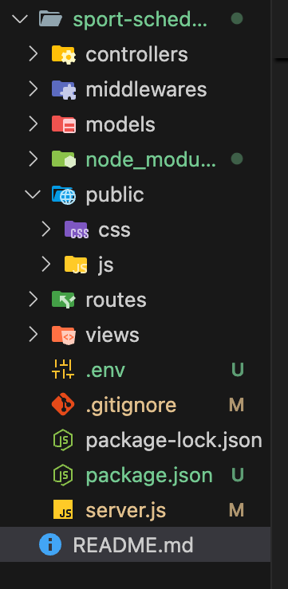

#  SportsScheduler

**SportsScheduler** is a web application that helps players **create, join, and manage sports sessions** with ease.  
It enables users to organize games, track participants, and handle cancellations smoothly.

## Features

User authentication with session-based login  
Create sports sessions with **teams, venue, and schedule**  
Join or cancel participation in sessions  
Session creators can cancel sessions with a reason  
 Simple, clean, and responsive interface built with **EJS templates**  

## Tech Stack:

**Backend:** Node.js, Express.js  
**Frontend:** EJS, HTML, CSS  
**Database:** MongoDB (Mongoose ODM)  
**Authentication:** Express-session  
**Deployment:** Render  

---

## Screenshots

  
    
  <h3>Sign Up Page<h3>
  
    
  <h3>Login Page<h3>
  
    
  <h3>Create a Sport</h3>
  
  <h3>Create a Session</h3>
  

Demo Video: [SportsScheduler on YouTube](https://youtu.be/-O5M2MjxTlQ) 

## Getting Started
### Clone the repository
git clone https://github.com/Hari-Krishna-9999/SPORTSCHEDULER.git
cd sports-scheduler
